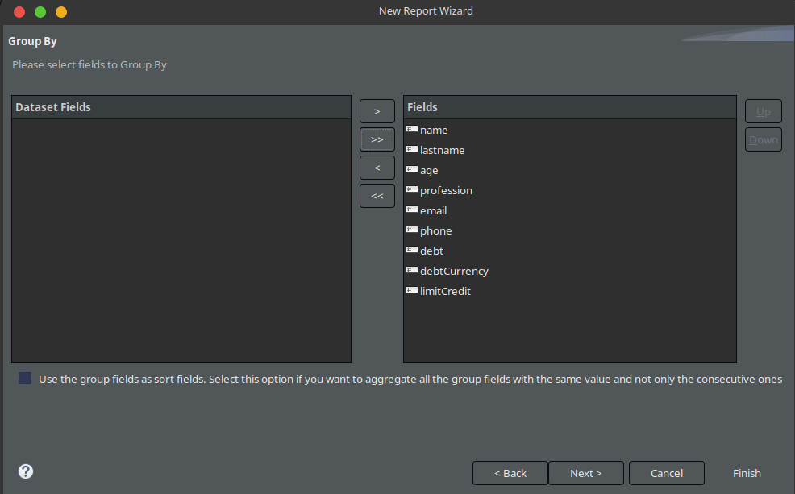
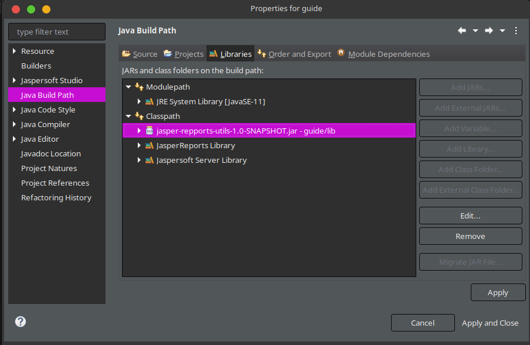
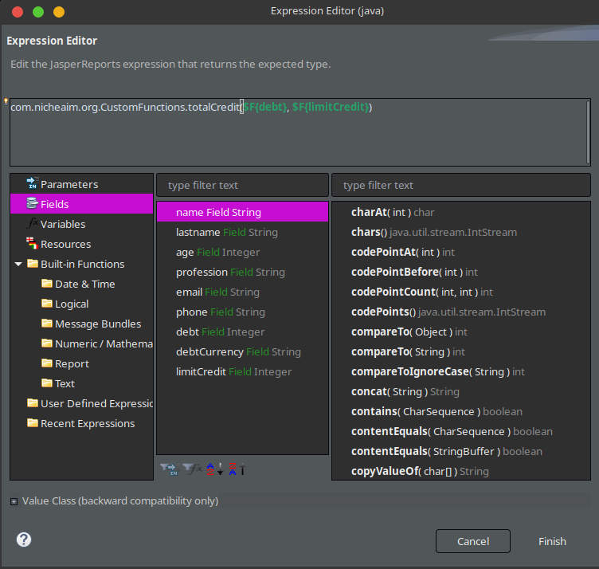

# JRCustomFunctions

## Description

Jasper Report is an open source Java reporting tool that can write to a variety of targets such as:

- screen
- a printer
- into PDF
- HTML
- CSV
- Excel
- RTF
- ODT
- XSL
- XML

## Introduction

### JRXML Files

You can make JasperReports using xml format on files with format called JRXML where you can generated or designed using tools.

### Jaspersoft Studio

You can make JasperReports usingn Jaspersoftstudio (In this guide we going to use the Community edition version). Jaspersoftstudio allow create highly formatted, pixel-perfect designed reports and data visualizations that meet any requirements and can pull from the widest selection of data sources.

### DataSources

On JasperReports we can have many DataSources like:

- JSON
- CSV Files
- Database JDBC Connection
- EJBQL Connection
- Hibernate
- Excel
- MongoDB
- XML
- JNDI

### Expressions

Report expressions are the powerful features of JasperReports, which allow us to display calculated data on a report. Calculated data is the data that is not a static data and is not specifically passed as a report parameter or datasource field.

## Custom Expressions

One way to have custom expressions on our JasperReports is using a Java class, just follow the below steps:

Make JSON file

```json
{
  "user": {
    "name": "Mauricio",
    "lastname": "Pasten",
    "age": 22,
    "profession": "Developer",
    "email": "mauricio.pasten@nicheaim.com",
    "phone": "+52 5538389460",
    "debt": 200,
    "debtCurrency": "MXN",
    "limitCredit": 1000
  }
}
```

- Add data adapter for JSON File

  

- Configure JSON Data Adapter

  

- Make Jasper Report Project

  

- Add New Report

  

- Save the Report and change the name if you want

  

- Add JSON Data Adapter to the report

  

- Select necessary fields

  
  

- Select Fields to GroupBy

  

- Select Finish

  

- Take the necessary fields and move to the report design

  

- Make new Java maven project with a custom method for example on this case we add total credit that return the limit fo credit for use.

  

- Package your project

  

- Make lib directory on Jasper Report Project and then copy the package of your maven application

  

- Refresh and then open the Config build path and add the new dir lib

  

- Add your package form lib to Classpath

  

- And also add to Orden and Export

  

- Select the report and go to Properties

  
  

- Add your class with custom expression

  

- Add new text field to use your custom expression

  

- Press doble click on the left selecting your new text field and open the expresion editor and then use the method that you make and pass the necessary params from your report. Like this

  

- And To finish this example just go to preview and see the behavior from the new text field

  
